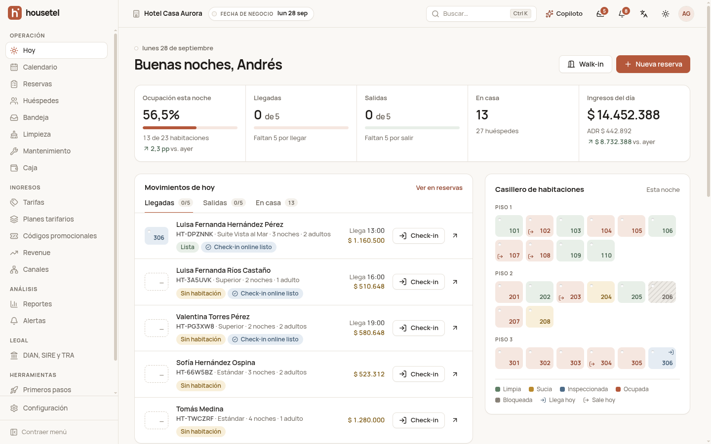

# Housetel

PMS hotelero SaaS para Colombia, al estilo de Cloudbeds. Incluye:

- recepción, calendario, reservas, housekeeping, tarifas y revenue;
- channel manager, un marketplace propio y un booking engine;
- portal del huésped con check-in online;
- facturación electrónica DIAN, SIRE y TRA;
- asistente de IA.

Todo corre en tu computador con **Docker**. No necesita credenciales externas: cada integración arranca en **modo simulado** y se pasa a real cuando se configura.



---

## Contenido

1. [Requisitos](#1-requisitos)
2. [Instalación en Windows 10/11 (paso a paso)](#2-instalación-en-windows-1011-paso-a-paso)
3. [Instalación en Linux o macOS](#3-instalación-en-linux-o-macos)
4. [Iniciar sesión](#4-iniciar-sesión)
5. [Recorrido de 5 minutos](#5-recorrido-de-5-minutos)
6. [Uso diario: apagar, encender, reiniciar](#6-uso-diario-apagar-encender-reiniciar)
7. [Solución de problemas](#7-solución-de-problemas)
8. [Integraciones reales](#8-integraciones-reales)
9. [Arquitectura y documentación](#9-arquitectura-y-documentación)

---

## 1. Requisitos

| Qué | Para qué | Dónde |
|---|---|---|
| **Docker Desktop** (Windows/macOS) o **Docker Engine + Compose v2** (Linux) | Corre toda la app | https://www.docker.com/products/docker-desktop/ |
| **Git** | Descargar el código | https://git-scm.com/downloads |
| 8 GB de RAM libres y ~10 GB de disco | La app levanta 7 servicios y carga ~3.300 reservas de demo | — |
| Puertos libres **5173**, **8010** y **8025** | App web, API y bandeja de correo de prueba | — |

No necesitas instalar Python ni Node: todo va dentro de los contenedores.

---

## 2. Instalación en Windows 10/11 (paso a paso)

### Paso 1 — Activar WSL 2 (una sola vez)

Docker Desktop usa WSL 2 (el subsistema de Linux de Windows).

1. Abre el menú Inicio, escribe **PowerShell**, clic derecho → **Ejecutar como administrador**.
2. Ejecuta:
   ```powershell
   wsl --install
   ```
3. **Reinicia el computador** cuando termine.
4. Si abre una ventana de Ubuntu pidiendo usuario y contraseña, créalos (o ciérrala: para esta guía no hace falta).

> Si `wsl --install` dice que ya está instalado, sigue al paso 2.

### Paso 2 — Instalar Docker Desktop

1. Descárgalo de https://www.docker.com/products/docker-desktop/ e instálalo con las opciones por defecto (deja marcada **"Use WSL 2 instead of Hyper-V"**).
2. Ábrelo y espera a que abajo a la izquierda diga **"Engine running"** (la ballena en verde).
3. Recomendado: **Settings → Resources** → dale al menos **6 GB de memoria** si tu equipo lo permite.

### Paso 3 — Instalar Git

1. Descárgalo de https://git-scm.com/download/win e instálalo con las opciones por defecto.

### Paso 4 — Descargar el proyecto

1. Abre **PowerShell** normal (no como administrador).
2. Ejecuta:
   ```powershell
   cd $HOME\Documents
   git clone https://github.com/BreynerTejada/housetel.git
   cd housetel
   ```
   > El repositorio es privado: la primera vez Git abre una ventana para iniciar sesión en GitHub. Tu cuenta debe tener acceso (pídele al dueño que te invite como colaborador).

### Paso 5 — Crear el archivo de configuración `.env`

Este comando crea `.env` con claves de seguridad nuevas:

```powershell
powershell -ExecutionPolicy Bypass -File .\scripts\setup.ps1
```

Debe responder **".env creado con claves nuevas."**. Si tienes una API key de Google Gemini (opcional, para la IA real), ábrela con `notepad .env` y pégala en `GEMINI_API_KEY=`.

### Paso 6 — Construir y encender la app

```powershell
docker compose up -d --build
```

La **primera vez tarda 5–10 minutos** (descarga imágenes e instala dependencias). Las siguientes veces arranca en segundos.

Espera a que el backend esté listo. Este comando debe responder `status : ok`:

```powershell
Invoke-RestMethod http://localhost:8010/api/v1/public/core/health/
```

Si da error, espera 30 segundos y repítelo.

### Paso 7 — Cargar los datos de demo

```powershell
docker compose stop worker beat
docker compose exec backend python manage.py seed_demo
docker compose start worker beat
```

Crea 3 hoteles, usuarios, huéspedes y ~3.300 reservas. **Tarda unos 10 minutos**; al final dice **"Seed completo"**. No cierres la ventana mientras corre. Se hace una sola vez: los datos quedan guardados.

### Paso 8 — Abrir la app

Abre en el navegador **http://localhost:5173** y sigue con [Iniciar sesión](#4-iniciar-sesión).

> **Mejor rendimiento (opcional):** si vas a modificar el código, clona el proyecto dentro de Ubuntu (WSL) y sigue la [guía de Linux](#3-instalación-en-linux-o-macos) desde la terminal de Ubuntu. Los archivos dentro de WSL son mucho más rápidos para Docker que los de `C:\`.

---

## 3. Instalación en Linux o macOS

```bash
git clone git@github.com:BreynerTejada/housetel.git      # o https://github.com/BreynerTejada/housetel.git
cd housetel
./scripts/setup.sh                                        # crea .env con claves nuevas
docker compose up -d --build                              # la primera vez tarda 5–10 min

# espera a que responda {"status":"ok"}
curl http://localhost:8010/api/v1/public/core/health/

# datos de demo (~10 min, una sola vez)
docker compose stop worker beat
docker compose exec backend python manage.py seed_demo
docker compose start worker beat
```

Abre **http://localhost:5173**. Si tienes `make` instalado, puedes usar los atajos de la sección 6.

---

## 4. Iniciar sesión

Entra a **http://localhost:5173/login**. La pantalla tiene botones de **acceso rápido** con las cuentas demo. También puedes escribirlas; **la contraseña de todas es `housetel123`**.

| Usuario | Rol | Qué ve al entrar |
|---|---|---|
| `owner@casaaurora.co` | Dueña de **Hotel Casa Aurora** (Cartagena, 24 habitaciones) | Todo: panel Hoy, calendario, tarifas, revenue, reportes, configuración |
| `recepcion@casaaurora.co` | Recepción | Panel Hoy, check-in/out, cobros y caja (tiene un turno de caja abierto) |
| `limpieza@casaaurora.co` | Housekeeping | "Mis habitaciones" (vista pensada para el celular) |
| `mantenimiento@casaaurora.co` | Mantenimiento | Tickets de mantenimiento |
| `contabilidad@casaaurora.co` | Contabilidad | Reportes, finanzas y legal (DIAN, SIRE, TRA) |
| `owner@grupoandino.co` | Dueño de **Grupo Andino** (hotel en Medellín + hostal por camas en Bogotá) | Cambia de hotel con el selector de arriba |
| `recepcion@grupoandino.co` | Recepción de Grupo Andino | — |
| `limpieza@grupoandino.co` | Housekeeping de Andino Medellín | — |
| `owner@hostaldemo.co` | Dueño de "Hostal Demo Trial" (cuenta en prueba, sin inventario) | Primeros pasos y configuración asistida |
| `admin@housetel.co` | **Super-admin** de la plataforma | `/admin`: métricas, hoteles, planes, cobros y comisiones |

**Otras direcciones útiles:**

| URL | Qué es |
|---|---|
| http://localhost:5173/ | Marketplace público para huéspedes (busca "Cartagena") |
| http://localhost:5173/h/casa-aurora | Motor de reservas del hotel (con la marca del hotel) |
| http://localhost:5173/signup | Registro de un hotel nuevo (prueba de 14 días + configuración con IA) |
| http://localhost:8025 | **Mailpit**: todos los correos que envía la app (confirmaciones, links de pago, check-in) |
| http://localhost:8010/api/docs/ | Documentación de la API |

**Portal del huésped:** cada reserva tiene su propio link. Para ver los de las llegadas próximas:

```bash
docker compose exec backend python manage.py portal_links --property casa-aurora --days 3
```

---

## 5. Recorrido de 5 minutos

1. **Recepción:** entra como `recepcion@casaaurora.co` → en **Hoy**, pulsa **Check-in** en una llegada lista → en **Salidas**, haz **Check-out** (si debe, cobra con "Registrar pago").
2. **Limpieza en el celular:** entra como `limpieza@casaaurora.co` (mejor desde el celular o con la ventana angosta) → la habitación que salió aparece para limpiar → **Iniciar → Terminar**.
3. **Calendario:** entra como dueña → **Calendario** → arrastra una reserva a otra habitación. Si está ocupada, la app lo impide.
4. **Reserva como huésped:** en http://localhost:5173 busca **Cartagena** → Hotel Casa Aurora → elige habitación → **Reservar** → pon nacionalidad **Estados Unidos** (verás el IVA exento) → **Pagar ahora** → en la pasarela simulada pulsa **Pagar**.
5. **WhatsApp:** **Herramientas → Simulador de WhatsApp** → escribe como huésped → respóndele desde **Bandeja**.
6. **Copiloto IA:** botón **Copiloto** arriba → pregunta *"¿Cuántas llegadas hay hoy?"*.

---

## 6. Uso diario: apagar, encender, reiniciar

| Acción | Comando (Windows, Linux y macOS) | Atajo con `make` |
|---|---|---|
| Encender | `docker compose up -d` | `make up` |
| Apagar (conserva los datos) | `docker compose stop` | `make down` |
| Ver el estado | `docker compose ps` | `make ps` |
| Ver logs | `docker compose logs -f backend` | `make logs` |
| Recargar los datos de demo | `docker compose exec backend python manage.py seed_demo` | `make seed` |
| **Borrar todo y empezar de cero** | `docker compose down -v` y luego los pasos 6 y 7 | `make reset` |
| Consola de Django | `docker compose exec backend python manage.py shell` | `make shell` |
| Tests | `docker compose run --rm backend pytest -q` · `docker compose run --rm frontend npm run test` | `make test` |

> La **fecha de negocio** del demo avanza sola cada noche a las 2:00 (auditoría nocturna automática). Por eso, días después del seed, las llegadas y salidas "de hoy" cambian, igual que en un hotel real.

---

## 7. Solución de problemas

| Síntoma | Solución |
|---|---|
| `error during connect` / `Cannot connect to the Docker daemon` | Docker Desktop no está abierto. Ábrelo y espera a que diga "Engine running". |
| `port is already allocated` (5173, 8010 u 8025) | Otro programa usa ese puerto. Ciérralo, o cambia el primer número del puerto en `docker-compose.yml` (por ejemplo `"5174:5173"`) y abre la app en el nuevo puerto. |
| `env file .env not found` | Te saltaste el paso 5 (crear `.env`). |
| La página queda en "Cargando…" mucho tiempo la primera vez | Es normal en desarrollo: cada pantalla se compila la primera vez que se abre. Las siguientes cargan rápido. |
| `relation … does not exist` al cargar el demo | El backend no había terminado de preparar la base de datos. Espera a que `health` responda `ok` y repite el seed. |
| El seed se detiene o el equipo va muy lento | Falta memoria: en Docker Desktop → Settings → Resources sube la memoria a 6–8 GB. |
| En Windows: `/bin/sh^M: bad interpreter` o scripts que fallan | El repo fuerza saltos de línea LF (`.gitattributes`). Si clonaste con una configuración antigua: `git config --global core.autocrlf input`, borra la carpeta y clona de nuevo. |
| `No puedo iniciar sesión` tras muchos intentos | Hay un límite de intentos por minuto: espera 1 minuto. |
| La IA responde "modo simulado" | Sin `GEMINI_API_KEY`, o se agotó la cuota gratuita de Gemini (20 llamadas/día). La app sigue funcionando con respuestas simuladas. |

---

## 8. Integraciones reales

Cada integración tiene un modo **simulado** (por defecto, funciona sin internet) y uno **real**. Se cambia por hotel en **Configuración → Integraciones**: eliges "Real", pegas las credenciales y pulsas "Probar conexión". Los secretos se guardan cifrados y nunca se vuelven a mostrar.

| Integración | Qué necesitas para el modo real |
|---|---|
| Pagos (Wompi) | Cuenta Wompi. Las llaves de **sandbox** son gratis e inmediatas |
| Factura electrónica DIAN (Factus) | Credenciales de sandbox de Factus; en producción, la habilitación del NIT ante la DIAN |
| Channel manager | iCal: los links de calendario de Airbnb o Booking. Channex: cuenta de staging |
| WhatsApp | Meta Business + número de WhatsApp Business + token; necesita URL pública (túnel) para recibir mensajes |
| TRA (MinCIT) | RNT del hotel + token de la plataforma TRA |
| SIRE (Migración Colombia) | Sin API: la app genera el archivo y se sube en el portal de Migración |
| Email | Un proveedor SMTP en el `.env` (localmente los correos van a Mailpit) |
| IA | `GEMINI_API_KEY` (o `ANTHROPIC_API_KEY`) en el `.env` |

Nunca pegues llaves o contraseñas en el código ni en issues: van en `.env` o en la pantalla de Integraciones.

---

## 9. Arquitectura y documentación

- **Backend:** `backend/` (Python 3.13, Django 5.2, DRF, Celery, PostgreSQL 17, Redis 7).
- **Frontend:** `frontend/` (React 19 + TypeScript + Vite + Tailwind 4).
- El código se monta como volumen: no hay que reconstruir al cambiar código, solo al cambiar dependencias.

| Servicio | Qué es | URL |
|---|---|---|
| `frontend` | App web (Vite hace proxy de `/api` y `/media` al backend) | http://localhost:5173 |
| `backend` | API Django (migra la BD al arrancar) | http://localhost:8010 |
| `worker` / `beat` | Tareas y automatizaciones programadas (Celery) | — |
| `db` / `redis` | PostgreSQL y Redis | no expuestos |
| `mailpit` | Servidor de correo de prueba | http://localhost:8025 |

Documentación del proyecto:

- Diseño del sistema: [`docs/superpowers/specs/2026-09-25-housetel-pms-design.md`](docs/superpowers/specs/2026-09-25-housetel-pms-design.md).
- Planes de implementación: [`docs/superpowers/plans/`](docs/superpowers/plans/).
- Notas por módulo (API con ejemplos, cómo probar en la UI): [`docs/integration-notes/`](docs/integration-notes/).
- Auditoría de producto frente a Cloudbeds: [`docs/audit/2026-09-28-auditoria-vs-cloudbeds.md`](docs/audit/2026-09-28-auditoria-vs-cloudbeds.md).
- Evidencia de la validación E2E en Chrome: [`docs/e2e-screenshots/`](docs/e2e-screenshots/).

**Ramas:**

- `main` es la versión estable y validada: fases A–C, con los 15 flujos probados en Chrome.
- `wip/phase-p` es la fase piloto en curso: producción, cuentas, reservas multi-habitación y grupos, facturación corporativa, importador y guía de integraciones reales.
